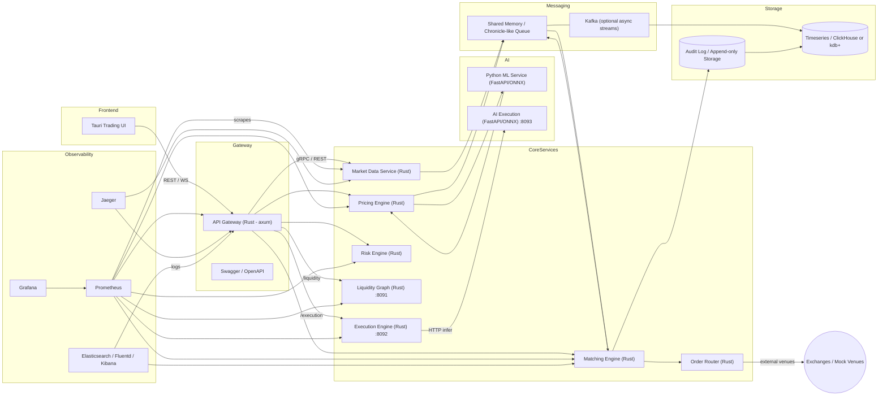

# Architecture FX eTrading — Ultra-Low-Latency Platform

## Notes (current local / gateway behavior)

- **Gateway** nests proxied services and forwards the path remainder from `OriginalUri` (e.g. `/matching/audit` → matching `/audit`).
- **Matching (`fx-core`)**: bid book sorted descending; `cancel_order` removes resting liquidity.
- **UI**: Talks to the gateway over HTTP/WS at `VITE_API_URL` (default `127.0.0.1:8080`). Prefer `npm run dev:stack` for matching + risk + liquidity + execution (Rust AI) + gateway + Tauri on Windows.
- **Publish**: crates.io release **0.1.3** includes `fx-liquidity-graph` and per-crate `DONATION.md` — see `PUBLISHING.md` / `scripts/publish-all.ps1`.
